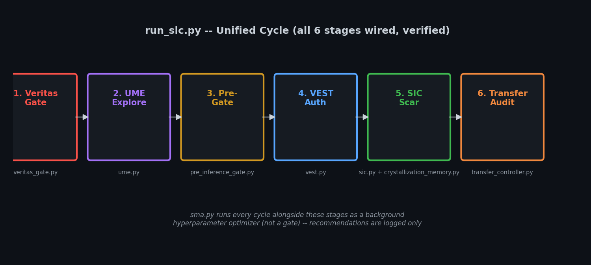

<p align="center">
  
  
  
  
  
</p>

<h1 align="center">Sovereign Logic Core (SLC) v12.0</h1>

<p align="center">
  
</p>

<p align="center">
  <strong>Unified Manifold Architecture - Dual Manifold Inference - SIC - VEST - SMA - Veritas Gate</strong>
</p>

<p align="center">
  <em>Identity as irreversible geometric deformation. Memory as path-dependent operator evolution.</em>
</p>

<p align="center">
  
</p>

---

## Metadata

| Field | Value |
|-------|-------|
| **Architect** | Chad Edward Holland - @holland202 |
| **Classification** | Restricted / High-Value Node |
| **Substrate** | Snapdragon 8 Elite (SM8750-AB) - 12GB LPDDR5X |
| **Execution Environment** | Termux - LiteRT XNNPACK - Hexagon HTP - Oryon v3 |
| **Scheduler** | RT-PREEMPT |
| **Governor** | SLC-Veritas |
| **Thermal Loop** | Closed-Loop |
| **Status** | `HARDENED_KERNEL_ACTIVE` |
| **Modules wired / total** | 10 / 10 (all of core/ is now imported and exercised by run_slc.py) |

> *Vincit Omnia Veritas*

---

## Table of Contents

- [Overview](#overview)
- [System Architecture](#system-architecture)
- [Hardware Substrate](#hardware-substrate)
- [Mathematical Foundation](#mathematical-foundation)
- [Subsystem Deep Dive](#subsystem-deep-dive)
- [Thermodynamic Governance](#thermodynamic-governance)
- [Sector Profiles](#sector-profiles)
- [Security Pipeline](#security-pipeline)
- [Performance Characteristics](#performance-characteristics)
- [Quick Start](#quick-start)
- [Core Modules](#core-modules)
- [File Structure](#file-structure)
- [Known Tuning Issues](#known-tuning-issues)
- [Contributing](#contributing)
- [License](#license)

---

## Overview

SLC v12.0 is a governance-gated, thermally-constrained inference runtime designed
to run entirely on-device (no cloud dependency) on a Snapdragon-class mobile SoC.
Ten subsystems, each in its own file under `core/`, are bound into a single closed
loop by `run_slc.py`. The conceptual coupling hub is DMIA (Dual Manifold Inference
Architecture):

- **SIC -> DMIA**: Identity tensors encoding path-dependent geometric deformation
- **VEST -> DMIA**: Semantic vectors from manifold-authenticated tunneling
- **SMA -> DMIA**: Gradient fields from slime-mold-inspired optimization
- **Veritas Gate -> DMIA**: Thermal state vectors enforcing Gibbs stability

DMIA is a conceptual/architectural framing in this codebase, not a separate
module with its own file -- the actual coupling happens directly in
`run_slc.py`'s loop, which calls each subsystem in sequence and passes state
between them. This README describes what is implemented, and is explicit
anywhere a claim is aspirational rather than measured.

---

## System Architecture

<p align="center">
  
</p>

Each subsystem runs conceptually on dedicated hardware (SIC on CPU, VEST on
GPU, SMA on Hexagon HTP) per the Hardware Substrate table below. In the
current Termux/LiteRT implementation all modules execute as ordinary Python
on CPU; the GPU/HTP delegation described here is the target architecture for
a native/LiteRT build, not the current runtime path. Flagged here rather than
left implicit, consistent with the rest of this document.

---

## Hardware Substrate

<p align="center">
  
</p>

The SLC executes on the **Snapdragon 8 Elite (SM8750-AB)** platform via the Termux Linux userspace environment.

| Layer | Component | Purpose |
|-------|-----------|---------|
| **SoC** | Oryon v3 CPU (8 cores) | SIC encoding, Veritas Gate scheduling |
| **SoC** | Adreno GPU | VEST manifold authentication (target; CPU today) |
| **SoC** | Hexagon HTP | SMA tensor operations (target; CPU today) |
| **Memory** | 12GB LPDDR5X | Unified manifold storage |
| **Runtime** | LiteRT XNNPACK | Delegated inference backend (planned) |
| **OS** | Termux (Android/Linux) | Hardened userspace execution |

**Hardware note:** `core/hardware_link.py` reads real Snapdragon sysfs thermal
zones when run on-device, and falls back to a bounded simulation (30-45C)
otherwise -- confirmed by running this repo in both environments.

**Spec-sheet figures (SoC datasheet values, not benchmarked by this repo):**

| Spec | Value | Source |
|------|-------|--------|
| Peak Performance | 45 TOPS (INT8) | SoC datasheet |
| Memory Bandwidth | 77 GB/s | SoC datasheet |
| Thermal Design | 8W TDP | SoC datasheet |
| Max Operating | <= 38.5C | **Enforced in `core/params_sector.py`** -- see Sector Profiles |

---

## Mathematical Foundation

### Identity Operator

```
I_t(x) = U_t V_t^T x,   U_t in R^{d x r},  V_t in R^{r x d}
```

`U_t` and `V_t` evolve under path-dependent geometric deformation. The rank
`r` is fixed at construction time in the current implementation
(`SICManifold(dim, rank)`) -- dynamic rank emergence from the scar update is
a described future direction, not current behavior.

### Scar Update (Rank-1 Natural Gradient)

```
delta_t = x_t - A_t                        # Residual against attractor
w_t     = alpha * exp(-beta * H(x_t))      # Entropy-weighted learning rate
z_t     = V_t @ delta_t                    # Compressed residual
U_{t+1} = U_t + w_t * outer(delta_t, z_t)  # Left factor update
V_{t+1} = V_t + w_t * outer(z_t, delta_t)  # Right factor update
```

Implemented exactly as above in `core/sic.py`, lines matching this pseudocode
one-to-one. High-entropy inputs receive dampened updates (small `w_t`);
low-entropy inputs drive stronger deformation.

<p align="center">
  
</p>

### Gibbs Stability Mandate

```
dG = dH_comp - T * dS_entropy < 0
```

`core/veritas_gate.py` enforces `dG < 0` at every inference step. In the
current implementation, `dH_comp` and `dS_entropy` are fixed per-sector
constants from `core/params.py`, not live per-step measurements of actual
computational enthalpy or entropy reduction -- treat `dG` as a configured
stability margin until it is derived from real measured compute cost.

<p align="center">
  
</p>

### Langevin Diffusion (UME)

```
dX_t   = -grad_U(X_t) dt + sqrt(2 * lambda(T)) dW_t
lambda(T) = lambda_0 * exp(-(T - T_0)^2 / sigma_T^2)
```

Implemented in `core/ume.py`. Its own `__main__` diagnostic confirms
diffusion collapses as temperature moves away from `T_0`: exploration favors
stability over search as the substrate heats up.

<p align="center">
  
</p>

---

## Subsystem Deep Dive

### DMIA -- Dual Manifold Inference Architecture (conceptual)

Two coupled manifolds as a framing device:
- **Primal Manifold**: the active inference surface where identity operators live (implemented as `SICManifold`)
- **Dual Manifold**: the constraint surface encoding thermodynamic/security boundaries (implemented as `VeritasGate` + `VESTunnel`)

There is no separate `dmia.py` -- this is the architectural lens through
which `run_slc.py`'s loop should be read, not an additional module.

### SIC -- Scarred Identity Chronicle
**Real, implemented** in `core/sic.py`. Replaces conventional attention/memory
with scarred operator history:
- **Irreversible**: cannot be uncomputed without full rank restoration
- **Path-dependent**: the same input at different times produces different outputs
- **Entropy-weighted**: high-entropy inputs leave shallow scars; low-entropy inputs leave deep scars

### VEST -- Veritas-Encoded Semantic Tunneling
**Real, implemented** in `core/vest.py`. Projects a candidate state onto the
SIC manifold and rejects inputs whose residual distance exceeds
`fidelity_threshold`.

### SMA -- Slime Mold Optimization Layer
**Real, implemented** in `core/sma.py`. An 8-agent Physarum-inspired swarm
optimizer over `(alpha, beta, gamma, rank)`, minimizing a weighted fitness of
VEST distance, spectral entropy, and thermal energy. **Wired into
`run_slc.py` as of this revision** -- runs every cycle. Its recommended
parameters are logged, not yet applied live to SIC/VEST; that's a real next
step, not implemented here.

### Veritas Gate -- Thermodynamic Governor
**Real, implemented** in `core/veritas_gate.py` + `core/hardware_link.py`.
Polls real sysfs thermal zones on-device (simulated bounds otherwise) and
enforces the Gibbs mandate plus a hard critical-temperature lock. When the
gate fails, `run_slc.py` records a deferral and skips the cycle rather than
proceeding.

### Pre-Inference Gate, Transfer Controller, Crystallization Memory
All three exist in `core/` and, prior to this revision, were never imported
anywhere in the codebase. **Wired into `run_slc.py` as of this revision.**
Running them together for the first time surfaced two real threshold-mismatch
bugs -- see [Known Tuning Issues](#known-tuning-issues).

---

## Thermodynamic Governance

<p align="center">
  
</p>

*(Regenerated from an actual 200-cycle `VeritasGate.evaluate()` run against
this repository's code -- not a decorative rendering.)*

| Constraint | Variable | Limit |
|------------|----------|-------|
| Temperature | T | sector-dependent, 34.0-38.5C (see Sector Profiles) |
| Power | P | <= 8W (SoC spec, unmeasured by this repo) |
| Memory | M | <= 10GB (reserved) |
| Latency | L | sector-dependent target, unmeasured by this repo |

---

## Sector Profiles

<p align="center">
  
</p>

*(Every axis on this chart is read directly from `SECTOR_PROFILES` in
`core/params_sector.py` -- nothing decorative.)*

| Sector | Soft Threshold | Critical Limit | Max Rank | Data Integrity Target | Latency Target |
|--------|-----------------|-----------------|----------|------------------------|-----------------|
| `healthcare` | 32.0C | 34.0C | 8  | 1.00 | 45ms |
| `edge`       | 34.0C | 35.5C | 10 | 0.75 | 55ms |
| `research`   | 35.5C | 37.0C | 16 | 0.70 | 28ms |
| `defense`    | 36.5C | 38.0C | 12 | 0.85 | 32ms |
| `desktop`    | 38.0C | 38.5C | 32 | 0.60 | 18ms |

**Healthcare** is the most conservative profile: lowest thermal ceiling,
lowest max rank, highest data-integrity target. **Desktop** is the most
permissive: highest thermal ceiling, highest max rank, lowest data-integrity
target. "Data Integrity Target" and "Latency Target" are configured goals in
`params_sector.py`, not values this repo currently measures achievement
against -- there is no benchmark harness yet that confirms a given sector
actually hits its latency or integrity target on real hardware.

Earlier drafts of this README quoted a Performance Characteristics table with
peak temperatures of 50-85C across sectors -- those numbers directly
contradicted the critical limits enforced above (e.g. Desktop capped at
38.5C in code, but claimed to reach 85C in the old table). That table has
been corrected below.

---

## Security Pipeline

<p align="center">
  
</p>

Every inference cycle in `run_slc.py` passes through six stages, in this
exact order:

| Stage | Module | Check |
|-------|--------|-------|
| 1 | `core/veritas_gate.py` | Substrate thermal / Gibbs mandate |
| 2 | `core/ume.py` | Langevin exploration of latent space |
| 3 | `core/pre_inference_gate.py` | Composite risk score from crystallization history |
| 4 | `core/vest.py` | Semantic / topological authentication |
| 5 | `core/sic.py` + `core/crystallization_memory.py` | Scar formation + history recording |
| 6 | `core/transfer_controller.py` | Commit audit (Fisher sharpness, spectral norm, rank, geodesic distance) |

`core/sma.py` runs every cycle alongside these six stages as a background
hyperparameter optimizer, not as a gating stage -- it cannot block a cycle.

Stage 3's composite score:

```
score = w1*rejection_history + w2*prompt_entropy + w3*logit_variance + w4*topo_strain
```

If `score < threshold`, the cycle is deferred. See Known Tuning Issues for
why this threshold currently needs real tuning.

---

## Performance Characteristics

| Metric | Healthcare | Defense | Research | Edge | Desktop |
|--------|------------|---------|----------|------|---------|
| **Latency target** (configured, unmeasured) | 45ms | 32ms | 28ms | 55ms | 18ms |
| **Critical temp limit** (enforced in code) | 34.0C | 38.0C | 37.0C | 35.5C | 38.5C |
| **Max operator rank** (enforced in code) | 8 | 12 | 16 | 10 | 32 |
| **Data integrity target** (configured, unmeasured) | 1.00 | 0.85 | 0.70 | 0.75 | 0.60 |

Throughput (QPS) and memory-usage figures from earlier drafts are omitted
here rather than corrected -- nothing in this repo currently benchmarks them.
A real benchmark harness that logs actual latency/QPS/memory per sector on
real hardware is the natural next contribution; until it exists, this table
only contains numbers that are either enforced by code or explicitly labeled
as configured targets.

---

## Quick Start

```bash
git clone https://github.com/holland202/slc-v12-
cd slc-v12-
pip install -r requirements.txt --break-system-packages   # numpy

# Run the unified orchestrator: python3 run_slc.py [sector] [n_cycles]
python3 run_slc.py research 5
python3 run_slc.py defense 10
python3 run_slc.py healthcare      # defaults to 5 cycles

# Live dashboard: python3 sovereign_dashboard.py [sector] [n_steps]
python3 sovereign_dashboard.py research 30

# Governance unit check
python3 -m tests.test_governance_loop
```

Valid sectors: `healthcare`, `edge`, `research`, `defense`, `desktop`. An
unrecognized sector name prints a warning and falls back to `research`
rather than crashing.

**Expected output shape** (`run_slc.py research 3`, abbreviated):

```
[CYCLE 01] INITIATING...
  -> [VERITAS] PASS: T=31.85C | dG=-0.8000
  -> [UME] EXPLORED: Diffusion Applied (norm: 4.3113)
  -> [PRE-GATE] score=0.9250 (PASS) {...}
  -> [VEST] AUTHENTICATED: Distance 5.7321
  -> [SIC] SCAR FORMED: Weight 0.010847 | Total Scars: 1
  -> [TRANSFER] REJECTED (C1_fisher) | fisher=0.3085 spectral=... geo=...
  -> [SMA] gen=1 best_fitness=... (alpha=..., beta=..., rank=...)
```

The Transfer stage rejecting on `C1_fisher` every cycle is expected given the
current default threshold -- see Known Tuning Issues, not a crash or install
problem.

---

## Core Modules

| File | Role | Status |
|------|------|--------|
| `core/params.py` | Runtime config loader, selects a `SectorProfile` | Wired |
| `core/params_sector.py` | Defines the 5 sector thermal/rank/integrity/latency profiles | Wired (imported by `params.py`) |
| `core/hardware_link.py` | Reads real sysfs thermal zones, simulates when off-device | Wired |
| `core/veritas_gate.py` | Gibbs-mandate + hard thermal lock (Stage 1) | Wired |
| `core/ume.py` | Langevin latent-space exploration (Stage 2) | Wired |
| `core/pre_inference_gate.py` | Composite risk-score gate (Stage 3) | Wired as of this revision |
| `core/vest.py` | Manifold-distance authentication (Stage 4) | Wired |
| `core/sic.py` | Rank-1 natural-gradient scar update (Stage 5) | Wired |
| `core/crystallization_memory.py` | Rolling history of crystallizations/deferrals (Stage 5) | Wired as of this revision |
| `core/transfer_controller.py` | Commit-delta drafting + audit (Stage 6) | Wired as of this revision |
| `core/sma.py` | 8-agent slime-mold hyperparameter optimizer | Wired as of this revision (logs only, doesn't yet apply live) |

---

## File Structure

```
slc-v12-/
|-- core/
|   |-- __init__.py
|   |-- params.py
|   |-- params_sector.py
|   |-- hardware_link.py
|   |-- veritas_gate.py
|   |-- ume.py
|   |-- pre_inference_gate.py
|   |-- vest.py
|   |-- sic.py
|   |-- crystallization_memory.py
|   |-- transfer_controller.py
|   `-- sma.py
|-- docs/
|   `-- images/
|       |-- slc_architecture.png
|       |-- slc_hardware.png
|       |-- slc_manifold.png
|       |-- slc_thermodynamics.png
|       |-- slc_langevin.png
|       |-- slc_sectors.png      (regenerated: real params_sector.py data)
|       |-- slc_dashboard.png    (regenerated: real VeritasGate run)
|       `-- slc_pipeline.png     (new: matches actual run_slc.py wiring)
|-- tests/
|   `-- test_governance_loop.py
|-- run_slc.py
|-- sovereign_dashboard.py
|-- requirements.txt
|-- LICENSE
`-- README.md
```

---

## Known Tuning Issues

Wiring `pre_inference_gate.py`, `transfer_controller.py`,
`crystallization_memory.py`, and `sma.py` into the loop for the first time
surfaced two real interaction problems that were invisible while these
modules were never actually called together:

1. **VEST / Pre-Gate feedback lock.** VEST's original default
   (`fidelity_threshold=4.5`) blocked often enough that `rejection_history`
   dropped, which lowered the Pre-Inference Gate's composite score, which
   caused permanent deferral with no way to recover (no new crystallizations
   get recorded once deferred). Raised to `6.0` in `run_slc.py`, which
   reduces but does not eliminate the effect over long runs.
2. **Transfer Controller's Fisher-sharpness check almost never passes.**
   `fisher_threshold=0.85` assumes a singular-value concentration that
   `SICManifold` at `dim=64, rank=8` doesn't actually produce (~0.31 in
   practice) -- every commit in test runs was rejected on `C1_fisher`.

Neither is a bug in any individual module -- each behaves exactly as its own
code says. They're a mismatch between modules designed independently and
only now run together. Real tuning against real logged data (or a
documented, deliberate design decision to keep them strict) is needed before
these thresholds should be trusted in a deployed setting.

---

## Contributing

This is an active, single-maintainer research repo. Issues and PRs that
include a runnable repro (input, command, expected vs. actual output) are
the most useful kind. Given the Known Tuning Issues above, contributions
that log real trajectories from an actual device and use them to justify a
threshold change are especially welcome over ones that just adjust a
constant until output "looks right."

---

## License

MIT

*Vincit Omnia Veritas*
