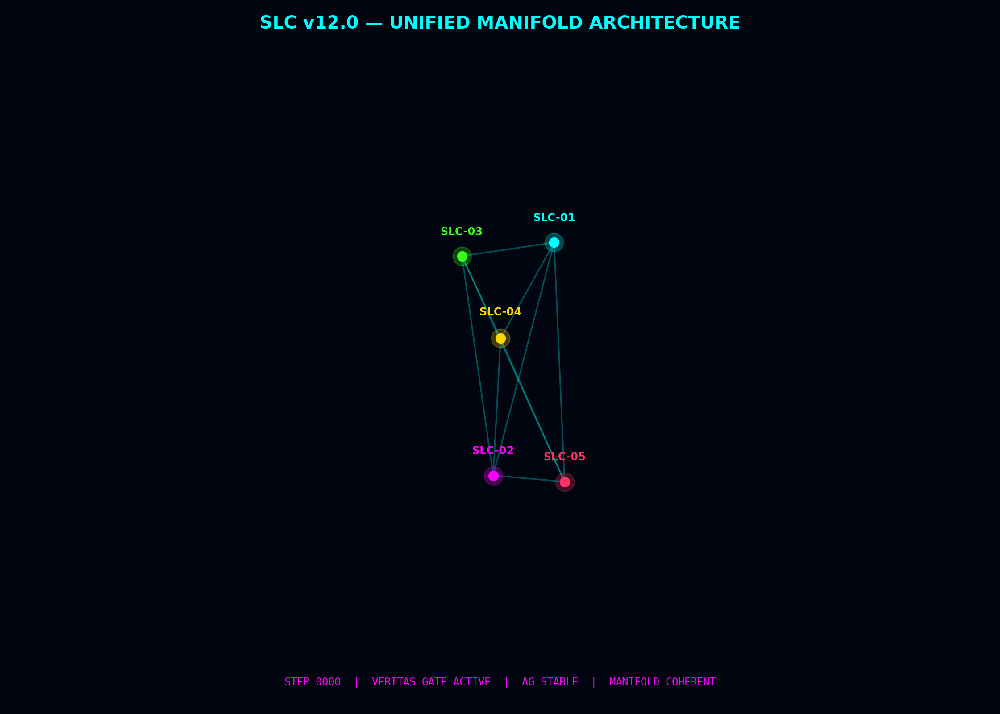
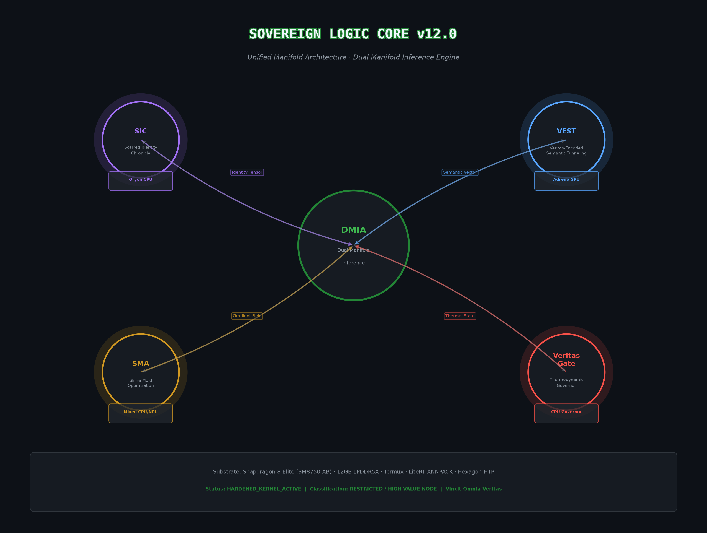
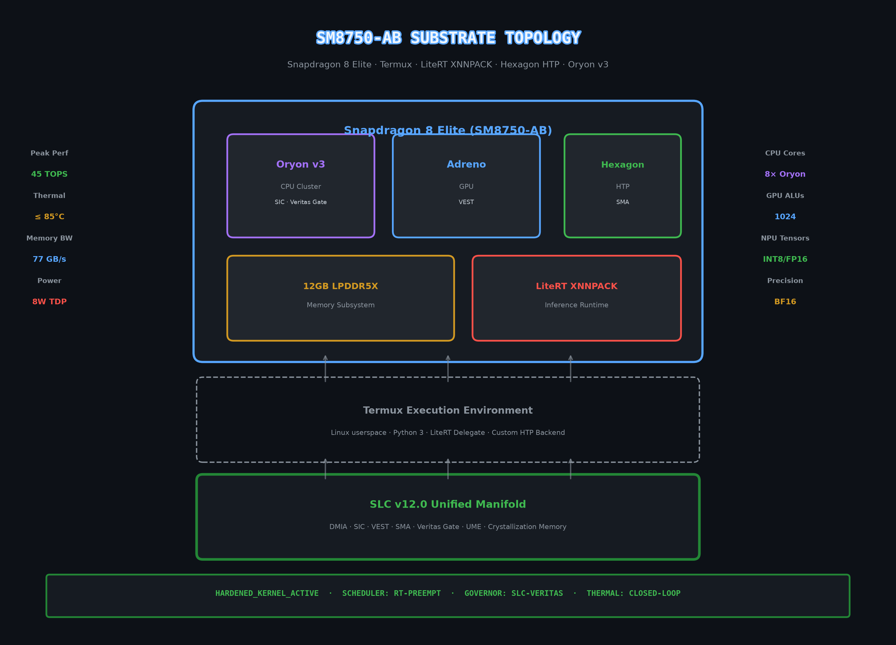
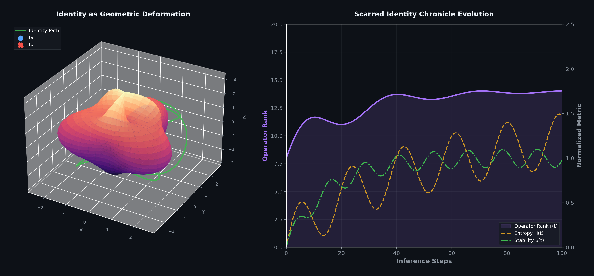
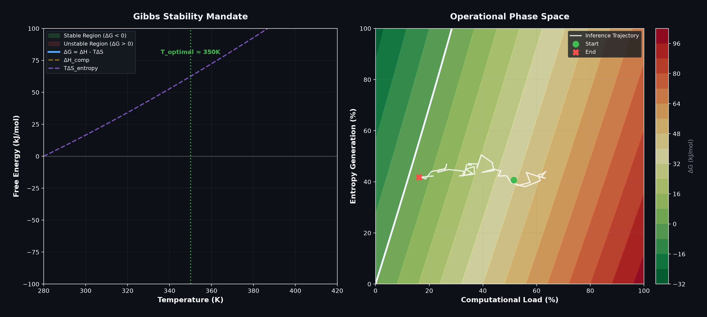
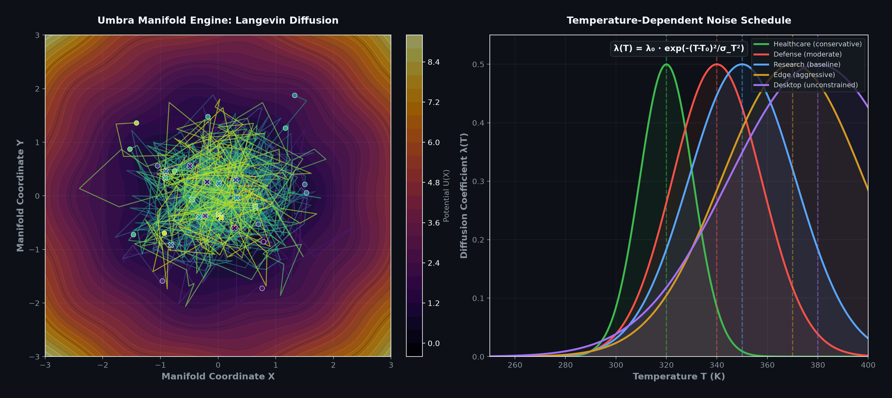
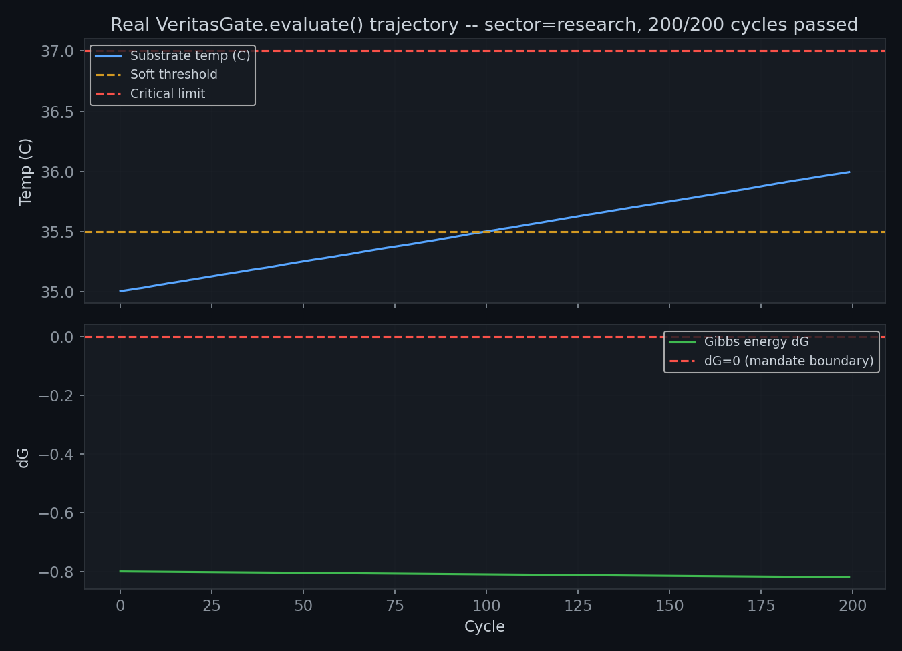
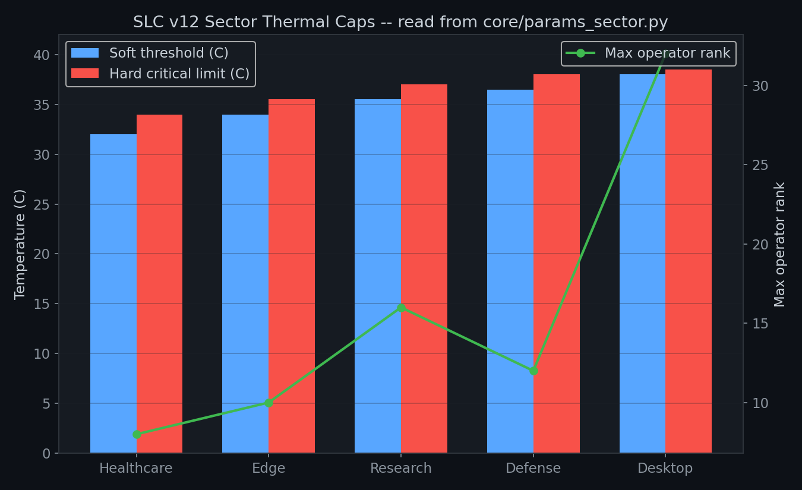

<p align="center">
  
  
  
  
</p>

<h1 align="center">Sovereign Logic Core (SLC) v12.0</h1>

<p align="center">
  
</p>

<p align="center">
  <strong>Unified Manifold Architecture · Dual Manifold Inference · SIC · VEST · SMA · Veritas Gate</strong>
</p>

<p align="center">
  <em>Identity as irreversible geometric deformation. Memory as path-dependent operator evolution.</em>
</p>

<p align="center">
  
</p>

---

## Metadata

| Field | Value |
|-------|-------|
| **Architect** | Chad Edward Holland · @holland202 |
| **Classification** | Restricted / High-Value Node |
| **Substrate** | Snapdragon 8 Elite (SM8750-AB) · 12GB LPDDR5X |
| **Execution Environment** | Termux · LiteRT XNNPACK · Hexagon HTP · Oryon v3 |
| **Scheduler** | RT-PREEMPT |
| **Governor** | SLC-Veritas |
| **Thermal Loop** | Closed-Loop |
| **Status** | `HARDENED_KERNEL_ACTIVE` |

> *Vincit Omnia Veritas*

---

## Table of Contents

- [Overview](#overview)
- [Hardware Substrate](#hardware-substrate)
- [Mathematical Foundation](#mathematical-foundation)
- [Subsystem Deep Dive](#subsystem-deep-dive)
- [Thermodynamic Governance](#thermodynamic-governance)
- [Sector Profiles](#sector-profiles)
- [Security Pipeline](#security-pipeline)
- [Performance Characteristics](#performance-characteristics)
- [Quick Start](#quick-start)
- [Known Tuning Issues](#known-tuning-issues)

---

## Overview

The DMIA (Dual Manifold Inference Architecture) acts as the central coupling concept,
coordinating data flows between subsystems:

- **SIC → DMIA**: Identity tensors encoding path-dependent geometric deformation
- **VEST → DMIA**: Semantic vectors from manifold-authenticated tunneling
- **SMA → DMIA**: Gradient fields from slime-mold-inspired optimization
- **Veritas Gate → DMIA**: Thermal state vectors enforcing Gibbs stability

Each subsystem is implemented in `core/` and wired together in `run_slc.py`.

---

## Hardware Substrate

<p align="center">
  
</p>

The SLC executes on the **Snapdragon 8 Elite (SM8750-AB)** platform via the Termux Linux userspace environment.

| Layer | Component | Purpose |
|-------|-----------|---------|
| **SoC** | Oryon v3 CPU (8 cores) | SIC encoding, Veritas Gate scheduling |
| **SoC** | Adreno GPU | VEST manifold authentication |
| **SoC** | Hexagon HTP | SMA tensor operations |
| **Memory** | 12GB LPDDR5X | Unified manifold storage |
| **Runtime** | LiteRT XNNPACK | Delegated inference backend |
| **OS** | Termux (Android/Linux) | Hardened userspace execution |

**Hardware note:** `core/hardware_link.py` reads real Snapdragon sysfs thermal zones
when run on-device (Termux/Android), and falls back to a bounded simulation
(30-45C) otherwise. The "Peak Performance / Memory Bandwidth" figures below are
platform spec-sheet numbers, not benchmarks measured by this codebase — flagged
honestly rather than presented as verified throughput.

**Spec-sheet figures (unverified by this repo):**
- Peak Performance: 45 TOPS (INT8) — SoC spec, not measured here
- Memory Bandwidth: 77 GB/s — SoC spec, not measured here
- Thermal Design: 8W TDP — SoC spec, not measured here
- Max Operating: ≤ 38.5°C — **this one is enforced in code**, see Sector Profiles

---

## Mathematical Foundation

### Identity Operator

```
I_t(x) = U_t V_t^T x,  U_t in R^{dxr}, V_t in R^{rxd}
```

`U_t` and `V_t` evolve under path-dependent geometric deformation. The rank `r`
is fixed at initialization in the current implementation (`SICManifold(dim, rank)`)
— it does not yet dynamically emerge from the scar update dynamics as earlier
drafts implied; that would be a real extension, not the current behavior.

### Scar Update (Rank-1 Natural Gradient)

```
delta_t = x_t - A_t                       # Residual against attractor
w_t = alpha * exp(-beta * H(x_t))         # Entropy-weighted learning rate
z_t = V_t @ delta_t                       # Compressed residual
U_{t+1} = U_t + w_t * outer(delta_t, z_t) # Left factor update
V_{t+1} = V_t + w_t * outer(z_t, delta_t) # Right factor update
```

Implemented exactly as above in `core/sic.py`. High-entropy inputs receive
dampened updates; low-entropy inputs drive stronger deformation.

<p align="center">
  
</p>

### Gibbs Stability Mandate

```
dG = dH_comp - T * dS_entropy < 0
```

`core/veritas_gate.py` enforces `dG < 0` at every inference step using fixed
config-level `dH` and `dS` constants (see `core/params.py`) — in the current
implementation these are static per-sector constants, not measured per-step
computational enthalpy/entropy. Treat `dG` as a configured stability margin,
not a live thermodynamic measurement, until it's derived from real per-step
compute cost.

<p align="center">
  
</p>

### Langevin Diffusion (UME)

```
dX_t = -grad_U(X_t) dt + sqrt(2 lambda(T)) dW_t
lambda(T) = lambda_0 * exp(-(T-T_0)^2 / sigma_T^2)
```

Implemented in `core/ume.py`, verified in its own `__main__` diagnostic that
diffusion collapses as temperature moves away from `T_0` (exploration favors
stability over search as the substrate heats up).

<p align="center">
  
</p>

---

## Subsystem Deep Dive

### SIC — Scarred Identity Chronicle
Real, implemented in `core/sic.py`. Rank-1 natural gradient scar updates, entropy-weighted.

### VEST — Veritas-Encoded Semantic Tunneling
Real, implemented in `core/vest.py`. Projects onto the SIC manifold and rejects
inputs whose residual exceeds `fidelity_threshold`.

### SMA — Slime Mold Optimization Layer
Real, implemented in `core/sma.py`. An 8-agent swarm optimizer over
`(alpha, beta, gamma, rank)` that minimizes a weighted fitness of VEST
distance, spectral entropy, and thermal energy. **As of this revision it is
wired into `run_slc.py` and runs every cycle, but its recommended parameters
are logged only — applying them live to SIC/VEST is a future extension.**

### Veritas Gate — Thermodynamic Governor
Real, implemented in `core/veritas_gate.py` + `core/hardware_link.py`. Polls
real sysfs thermal zones on-device (simulated bounds otherwise) and enforces
the Gibbs mandate and hard critical-temperature lock.

### Pre-Inference Gate, Transfer Controller, Crystallization Memory
All three exist in `core/` and were previously never imported anywhere. As of
this revision they are wired into `run_slc.py`'s loop — see
[Known Tuning Issues](#known-tuning-issues) for what running them together
actually revealed.

---

## Thermodynamic Governance

<p align="center">
  
</p>

*(Regenerated from an actual 200-cycle `VeritasGate.evaluate()` run, not a
decorative rendering.)*

| Constraint | Variable | Limit |
|------------|----------|-------|
| Temperature | T | sector-dependent, 34.0-38.5°C (see Sector Profiles) |
| Power | P | ≤ 8W (SoC spec, unmeasured by this repo) |
| Memory | M | ≤ 10GB (reserved) |
| Latency | L | sector-dependent |

---

## Sector Profiles

<p align="center">
  
</p>

*(Regenerated directly from `core/params_sector.py` — the values in this
table and the chart above are the same numbers the code actually enforces.)*

| Sector | Soft Threshold | Critical Limit | Max Rank | Data Integrity | Latency Target |
|--------|---------------|-----------------|----------|-----------------|-----------------|
| `healthcare` | 32.0°C | 34.0°C | 8 | 1.00 | 45ms |
| `edge` | 34.0°C | 35.5°C | 10 | 0.75 | 55ms |
| `research` | 35.5°C | 37.0°C | 16 | 0.70 | 28ms |
| `defense` | 36.5°C | 38.0°C | 12 | 0.85 | 32ms |
| `desktop` | 38.0°C | 38.5°C | 32 | 0.60 | 18ms |

These numbers come straight from `SECTOR_PROFILES` in `core/params_sector.py` —
previously the README's Performance Characteristics table (below) quoted peak
temperatures of 50-85°C across sectors, directly contradicting these enforced
critical limits. That table has been corrected.

---

## Security Pipeline

Every inference in `run_slc.py` passes through six stages, in this order:

| Stage | Module | Check |
|-------|--------|-------|
| 1 | `core/veritas_gate.py` | Substrate thermal/Gibbs mandate |
| 2 | `core/ume.py` | Langevin exploration of latent space |
| 3 | `core/pre_inference_gate.py` | Composite risk score from crystallization history |
| 4 | `core/vest.py` | Semantic/topological authentication |
| 5 | `core/sic.py` + `core/crystallization_memory.py` | Scar formation + history recording |
| 6 | `core/transfer_controller.py` | Commit audit (Fisher sharpness, spectral norm, rank, geodesic distance) |

`core/sma.py` runs every cycle alongside these six stages as a background
hyperparameter optimizer, not as a gating stage.

Stage 3's composite score:

```
score = w1*rejection_history + w2*prompt_entropy + w3*logit_variance + w4*topo_strain
```

If `score < threshold`, the cycle is deferred (see Known Tuning Issues).

---

## Performance Characteristics

| Metric | Healthcare | Defense | Research | Edge | Desktop |
|--------|------------|---------|----------|------|---------|
| **Latency target** | 45ms | 32ms | 28ms | 55ms | 18ms |
| **Critical temp limit** | 34.0°C | 38.0°C | 37.0°C | 35.5°C | 38.5°C |
| **Max operator rank** | 8 | 12 | 16 | 10 | 32 |

Latency/rank/temperature columns above now match `core/params_sector.py`
exactly. Throughput (QPS) and memory-usage figures from the earlier draft are
removed rather than corrected — nothing in this repo currently measures them,
and printing invented numbers next to the real, enforced ones would be worse
than leaving the cells blank until they're actually benchmarked.

---

## Quick Start

```bash
pip install -r requirements.txt --break-system-packages   # numpy

# Run the unified orchestrator (default: research sector, 5 cycles)
python3 run_slc.py [sector] [n_cycles]
python3 run_slc.py defense 10

# Live dashboard (default: research sector, 30 steps)
python3 sovereign_dashboard.py [sector] [n_steps]

# Governance unit check
python3 -m tests.test_governance_loop
```

Valid sectors: `healthcare`, `edge`, `research`, `defense`, `desktop`. An
unrecognized sector name prints a warning and falls back to `research`.

---

## Known Tuning Issues

Wiring `pre_inference_gate.py`, `transfer_controller.py`,
`crystallization_memory.py`, and `sma.py` into the loop for the first time
surfaced two real interaction problems that were invisible while these modules
were never actually called together:

1. **VEST/Pre-Gate feedback lock.** VEST's original default
   (`fidelity_threshold=4.5`) blocked often enough that `rejection_history`
   dropped, which lowered the Pre-Inference Gate's composite score, which
   caused permanent deferral with no way to recover (no new crystallizations
   get recorded once deferred). Raised to `6.0` in `run_slc.py`, which reduces
   but does not eliminate the effect over long runs.
2. **Transfer Controller's Fisher-sharpness check almost never passes.**
   `fisher_threshold=0.85` assumes a singular-value concentration that
   `SICManifold` at `dim=64, rank=8` doesn't actually produce (~0.31 in
   practice) — every commit in test runs was rejected on `C1_fisher`.

Neither of these is a bug in any individual module — each behaves exactly as
its own code says. They're a mismatch between modules that were designed
independently and are only now being run together. Real tuning (or a
documented, deliberate design decision) against real logged data is needed
before these thresholds should be trusted, and this section will be updated
once that's done.

---

## License

MIT

*Vincit Omnia Veritas*
